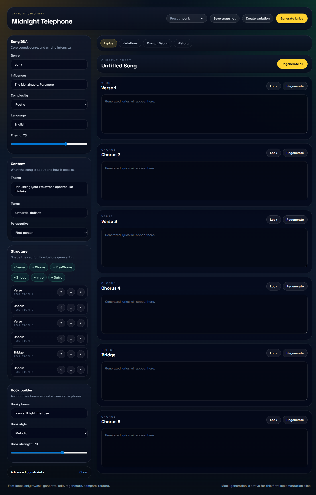
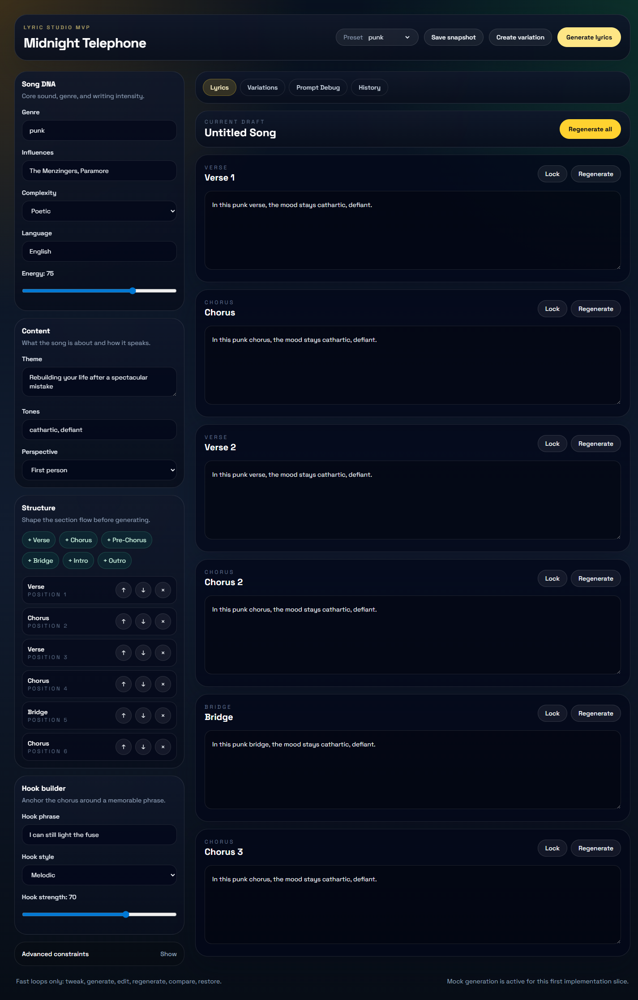
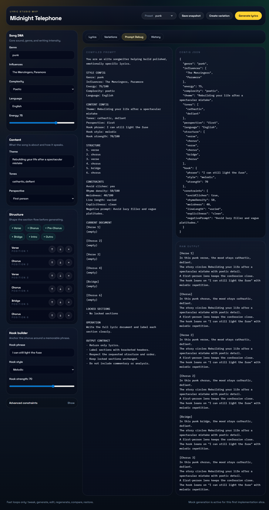
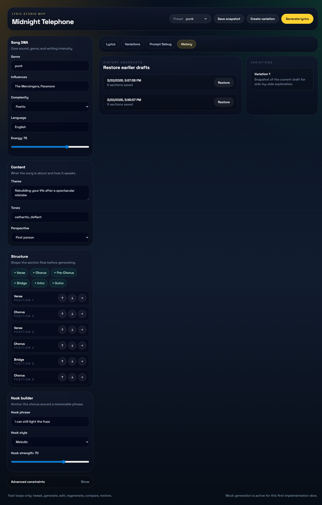

# Lyric Studio Usage Guide

This guide shows how to use the current Lyric Studio app from the first screen to saved drafts.

The app is a single studio workspace with two main areas:

- The left sidebar is where you shape the song brief.
- The main area is where you generate, edit, inspect, and restore lyrics.

Important: this MVP currently uses mock lyric generation. The generated text is based on your settings, but it does not call a live model yet.

## 1. Open the app

Start the app with:

```bash
npm run dev
```

Then open `http://localhost:5173`.

## 2. Learn the layout

When the app opens, you will see the full studio workspace.



### Header

At the top of the page you can:

- Rename the project.
- Switch between presets such as `punk`, `trap`, `indie`, or `ballad`.
- Save a snapshot of the current draft.
- Create a variation from the current draft.
- Generate lyrics for the full song.

### Left sidebar

Use the sidebar to define the song before generating:

- `Song DNA`: genre, influences, complexity, language, and energy.
- `Content`: theme, tones, and lyrical perspective.
- `Structure`: section order such as verse, chorus, bridge, intro, or outro.
- `Hook builder`: the phrase and style that should anchor the hook.
- `Advanced constraints`: optional controls for cliches, rhyme density, weirdness, line length, explicitness, and a negative prompt.

### Main workspace tabs

The top tab bar in the main panel gives you access to:

- `Lyrics`: edit the draft section by section.
- `Variations`: reserved for a future compare view.
- `Prompt Debug`: inspect the compiled prompt, config JSON, and raw output.
- `History`: restore snapshots and review saved variations.

## 3. Generate a first draft

After setting your genre, theme, structure, and hook, click `Generate lyrics`.

The app fills each section in the current structure. You can also use `Regenerate all` inside the draft panel.



What to expect:

- Every section gets its own card and editable text box.
- Each card has `Lock` and `Regenerate` controls.
- `Lock` prevents that section from being replaced during future generation.
- `Regenerate` refreshes only that one section.

## 4. Edit and refine the draft

The `Lyrics` tab is designed for quick iteration:

- Click directly into any section to edit the text.
- Lock strong sections before regenerating the rest of the song.
- Change sidebar settings at any time, then generate again.
- Reorder or add sections in `Structure` to reshape the song.

This is the fastest loop in the app:

1. Set the brief in the sidebar.
2. Generate lyrics.
3. Edit the best lines manually.
4. Lock the sections you want to keep.
5. Regenerate the weaker sections.

## 5. Inspect how the prompt was built

Open `Prompt Debug` when you want to see exactly what the app compiled from your settings.



This screen shows:

- The compiled prompt used for generation.
- The current config as JSON.
- The raw generated output before it is parsed into section cards.

This is useful when you want to understand why a draft looks the way it does.

## 6. Save snapshots and variations

Use `Save snapshot` whenever you reach a version you may want to revisit later.

Use `Create variation` when you want to pin the current draft as an alternate idea.

Open the `History` tab to manage them.



In this view:

- `History snapshots` lists saved versions with timestamps.
- `Restore` replaces the current config and lyrics with that earlier snapshot.
- `Variations` shows saved alternate drafts created from the header.

Note: the separate `Variations` tab is still a placeholder in this MVP. Right now, saved variations are visible in the `History` tab.

## 7. Persistence

Your project state is saved in the browser's local storage, including:

- project title
- song configuration
- current lyric document
- history snapshots
- variations
- active tab

That means your work should still be there when you refresh the page in the same browser.

## 8. Suggested first workflow

If you are using the app for the first time, this is the easiest path:

1. Pick a preset.
2. Rename the project.
3. Write a clear `Theme`.
4. Set `Tones` and `Perspective`.
5. Adjust the `Structure`.
6. Add a memorable `Hook phrase`.
7. Click `Generate lyrics`.
8. Edit the strongest lines.
9. Lock the sections you like.
10. Save a snapshot before trying a new direction.

## Current limitations

- Generation is mocked, not connected to a live AI model.
- The `Variations` tab does not yet provide side-by-side comparison tools.
- There is no export feature yet.
- Snapshots and drafts are browser-local, not synced to a server.
